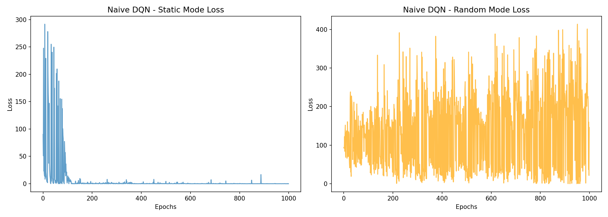
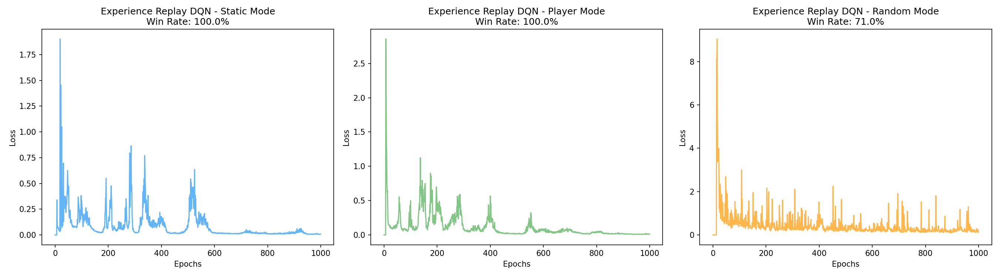
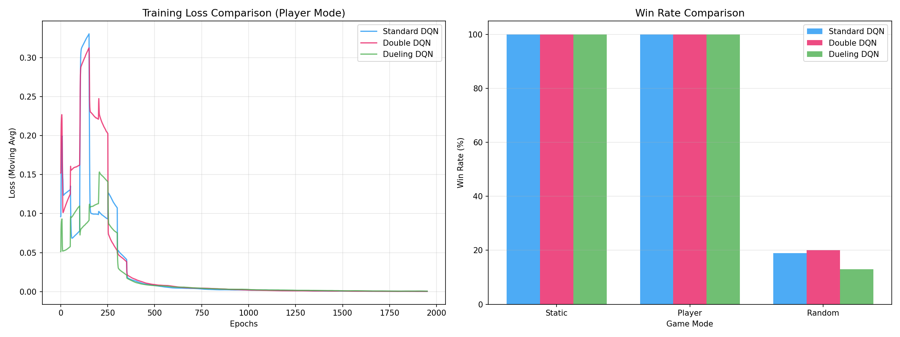
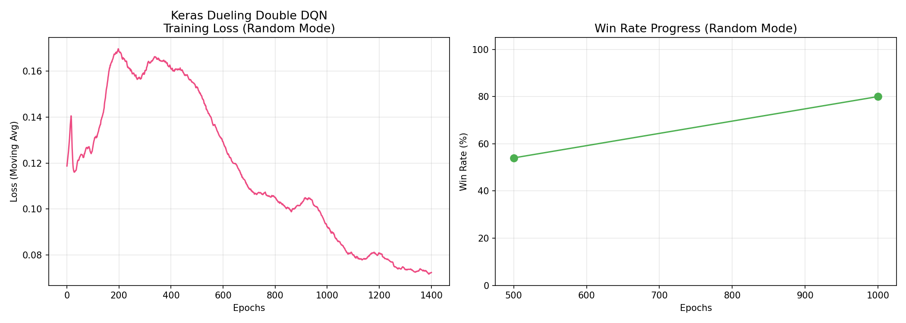

# HW3：DQN and its Variants

> 深度強化學習 作業三 | 學號：5114056021 | 姓名：黃子軒

## 📋 作業目的

實作並比較多種 DQN（Deep Q-Network）變體，從基礎的 Naive DQN 到進階的 Double DQN、Dueling DQN，並將 PyTorch 實作轉換為 Keras，整合多種訓練技巧以穩定隨機環境下的學習效果。

## 🗺️ 環境描述

採用 **Gridworld 4×4** 網格環境，包含四個物件：

```
┌───┬───┬───┬───┐
│ + │   │   │   │  + = Goal (+10)
├───┼───┼───┼───┤
│   │   │   │   │  - = Pit (-10)
├───┼───┼───┼───┤
│   │   │ - │   │  W = Wall
├───┼───┼───┼───┤
│ P │   │   │ W │  P = Player
└───┴───┴───┴───┘
```

| 項目 | 設定 |
|------|------|
| 網格大小 | 4 × 4 |
| 狀態表示 | 4×4×4 → 展平為 64 維向量 |
| 動作空間 | 4 個（上/下/左/右） |
| 獎勵 | Goal: +10, Pit: -10, 每步: -1 |

### 三種模式

| 模式 | 說明 | 對應子任務 |
|------|------|-----------|
| **Static** | 所有物件位置固定 | HW3-1 |
| **Player** | 只有 Player 隨機 | HW3-2 |
| **Random** | 所有物件皆隨機 | HW3-3 |

## 📊 作業內容與結果

### HW3-1：Naive DQN for Static Mode [30%]

實作兩種 DQN 並比較：

| 方法 | Static 勝率 | Player 勝率 | Random 勝率 |
|------|:-----------:|:-----------:|:-----------:|
| Naive DQN | **100%** | — | 27% |
| Experience Replay DQN | **100%** | **100%** | **71%** |

**Loss 曲線 — Naive DQN：**



**Loss 曲線 — Experience Replay DQN：**



**關鍵發現：**
- Naive DQN 在 static mode 下表現完美，但無法泛化到 random mode（27%）
- Experience Replay 透過隨機取樣打破經驗相關性，大幅提升 random mode 勝率至 71%

---

### HW3-2：Enhanced DQN Variants for Player Mode [40%]

實作三種 DQN 變體並比較：

| 方法 | Static 勝率 | Player 勝率 | Random 勝率 |
|------|:-----------:|:-----------:|:-----------:|
| Standard DQN | **100%** | **100%** | ~19% |
| Double DQN | **100%** | **100%** | ~20% |
| Dueling DQN | **100%** | **100%** | ~13% |

**比較圖（Loss 曲線 + 勝率柱狀圖）：**



**關鍵差異：**
- **Double DQN**：分離動作選擇和 Q 值評估，解決 Q 值高估問題
- **Dueling DQN**：將 Q(s,a) 分解為 V(s) + A(s,a)，加速學習

---

### HW3-3：Keras DQN + Training Tips for Random Mode [30%]

將 PyTorch 轉換為 Keras，整合 7 個訓練技巧：

| # | 訓練技巧 | 說明 |
|---|---------|------|
| 1 | Target Network | 分離 online/target 網路 |
| 2 | Double DQN | online 選動作, target 估值 |
| 3 | Dueling DQN | 分離 V(s) 和 A(s,a) |
| 4 | Gradient Clipping | `clipnorm=1.0` 防止梯度爆炸 |
| 5 | LR Scheduling | 指數衰減 `decay_rate=0.995` |
| 6 | Soft Update | `θ_t = τ·θ_o + (1-τ)·θ_t`, τ=0.01 |
| 7 | Huber Loss | 比 MSE 更穩健的損失函數 |

**最終結果：Random mode 勝率達 80%**

**訓練曲線：**



## 📁 檔案結構

```
├── hw3_1_naive_dqn.py              # HW3-1: Naive DQN 實作
├── hw3_1_experience_replay_dqn.py  # HW3-1: Experience Replay DQN
├── hw3_1_understanding_report.md   # HW3-1: 理解報告
├── hw3_1_naive_dqn_loss.png        # HW3-1: Naive DQN Loss 曲線
├── hw3_1_replay_dqn_loss.png       # HW3-1: Replay DQN Loss 曲線
├── hw3_2_dqn_variants.py           # HW3-2: Standard/Double/Dueling DQN
├── hw3_2_dqn_comparison.png        # HW3-2: 三種 DQN 比較圖
├── hw3_3_keras_dqn.py              # HW3-3: Keras DQN + Training Tips
├── hw3_3_keras_dqn.png             # HW3-3: Keras 訓練曲線
├── conversation_log.md             # AI 對話紀錄
├── Gridworld.py                    # 環境檔案
├── GridBoard.py                    # 棋盤渲染
├── 第3章程式_ALL_IN_ONE (1).ipynb   # 原始 Notebook（參考用）
└── README.md                       # 本文件
```

## 🚀 執行方式

```bash
# 安裝依賴
pip install torch numpy matplotlib tensorflow

# 執行 HW3-1
python hw3_1_naive_dqn.py
python hw3_1_experience_replay_dqn.py

# 執行 HW3-2
python hw3_2_dqn_variants.py

# 執行 HW3-3
python hw3_3_keras_dqn.py
```

## 📌 結論

1. **Experience Replay** 是 DQN 實用化的關鍵改進，打破經驗相關性，將 random mode 勝率從 27% → 71%
2. **Double DQN** 有效解決 Q 值高估問題，在 player mode 下三種方法都達到 100%
3. **Dueling DQN** 透過分離 V(s) 和 A(s,a)，在不需要精確估計每個動作的狀態下加速學習
4. **Keras + 7 個訓練技巧**的組合在最困難的 random mode 下達到 **80% 勝率**，顯著優於基礎版本
